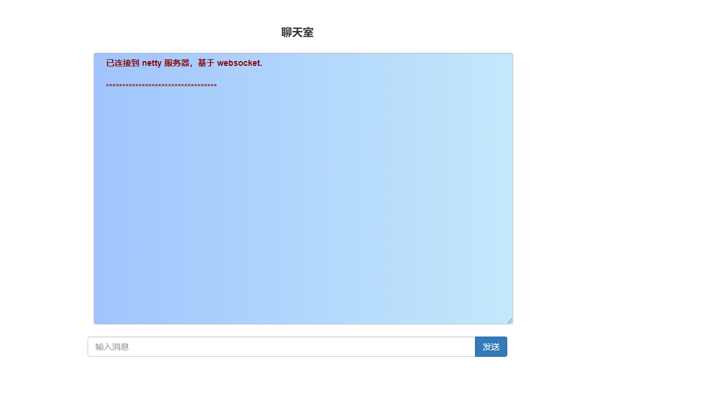
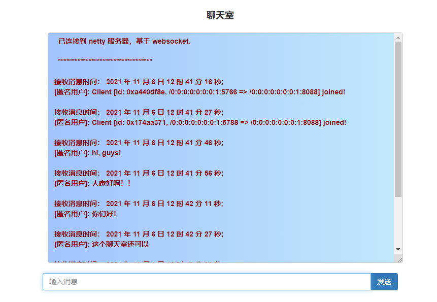
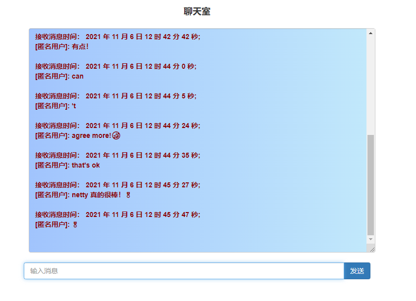

# 项目简介 📜
本项目包含了几个简单的基于 netty 的可运行实例，参考了 《netty in action》 等书，有助于帮助你快速了解 netty 的使用。

# 项目结构
本项目是基于 IDEA 开发的 maven 项目，pom.xml 文件中导入了相关的依赖，主要是 netty 包，下面是 java/com/ 文件夹下的几个章节的介绍：
- nettyDemo 文件夹：包含了一个最基本的 netty 服务端和客户端的实例，建议最开始从这个实例运行、调试并理解 netty 的基本工作原理；
- nettyExperiment 文件夹：在 nettyDemo 实例的基础上添加了一些自定义 handler；
- nettyByteBufTest 文件夹: 包含了对 ByteBuf 常见功能的使用；
- nettyCoderDemo 文件夹：包含了自定义 encoder 和 decoder 的实例，建议调试执行学习 netty 编码和解码的原理；
- nettyChatRoom 文件夹：使用 netty 开发的一个基于 websocket 协议的聊天室实例.

# ChatRoom 介绍
/java/com/chatRoom 文件夹包含了一个使用 netty 开发的基于 websocket 协议的聊天室实例，这个实例参考了 《netty in action》，实现起来很简单，从这个例子我们可以认识到 netty 强大的功能。

## websocket 协议
websocket 协议是依赖于 http 协议的，相对于 http 协议来说，websocket 协议的优势在于它对于持久连接以及双向通讯的支持，这是 http 的长连接和单向通讯所不能比拟的。
websocket 非常适合实时通讯场景。建立连接后，客户端和服务端的消息交换将以双向进行，不再是客户端发出一个 request 而服务端返回一个 response 这种单向模式，连接将持续存在，直到一方关闭连接，这样就不用反复建立连接了。

## ChatRoom 主要功能
我们实现的这个 ChatRoom 即聊天室，支持多个客户端先发起 http 连接，接收到我们返回的 index.html 文件，客户获得这个 html 文件后会与服务器建立 websocket 连接，每次加入一个新的连接，或者客户端发送一条消息，所有连接到服务器的客户端都将接收到消息。

## 服务器端实现
除了 resources 目录下，我们要返回给用户的 html 文件外，其余我们要做的就是基于 netty 的服务端开发，它包含了几个最重要的 handler;
- http 消息解码器，编码器（HttpServerCodec）;
- http 聚合器（HttpObjectAggregator）;
- 自定义的 HttpRequestHandler，主要功能是返回客户端 index.html 文件；
- 升级协议处理器 WebSocketServerProtocolHandler，这个是 netty 预置处理器，它会在建立 websocket 握手后，将 pipeline 中的所有 http 相关的处理器（编码器和解码器等）替换成 websocket 处理器（编码器和解码器等）；
- 自定义的 TextWebSocketFrameHandler，主要负责将接收的 websocket 类型消息发送给每个客户端；
将以上的 handler 加入 pipeline 中，定义对应的引导类即可.
我们的注释中实际上支持了 ssl，但是由于 ssl 和 websocket 对于浏览器有要求，所以我们下面的演示没有演示 ssl 的版本。  
  
## ChatRoom 演示
启动 ChatServer 类，可以在浏览器的多个页面访问 http://localhost:8088/，得到页面如下：

在不同的页面输入消息，点击发送，不同的页面会收到相应的消息：

另一个浏览器页面同时可以发送消息，并且接收消息：

# 总结
最近学习了解了 netty 的一些知识，体会到了 netty 的强大，自定义通信协议，nio 的进一步升级，在编写实例的时候，单步调试阅读源码，对 netty 的学习有更好的帮助。

